Daily Updates for 60DaysOfUdacity
==========

Day 1:
----------
As part of my foray into data analysis, I recently got my certificate in data analysis from DataCamp
Here is my certificate: https://www.datacamp.com/statement-of-accomplishment/track/7f664142a9a139e49b120194b06ab4a777e25e89

&#35;60DaysofUdacity

Day 2:
----------
Completed the Python Programmer Track from DataCamp. Here is my certificate:
https://www.datacamp.com/statement-of-accomplishment/track/498b6cfe35a643f922395ba2297425bda017c824

&#35;60DaysofUdacity

Day 3:
----------
I reviewed the course Applied AI with Deep Learning from Coursera that touches the following concepts and applications:
1. Deep learning frameworks such as Tensorflow, SystemML, Keras, DeepLearning4J and of course, PyTorch.
2. Learned about Anomaly Detection, Time Series Forecasting, Image Recognition and Natural Language Processing by building up models using Keras on real-life examples from IoT, Financial Marked Data, Literature or Image Databases.
3. Scale deep learning models using Apache Spark and CUDA-enabled GPUs in IBM Cloud Jupyter Notebooks.
You may look at my certificate here: https://www.coursera.org/account/accomplishments/records/XE8F6K6L47L9

&#35;60DaysofUdacity

Day 4:
----------
I recently listened to a podcast by Katharine Jarmul (https://www.datacamp.com/community/podcast/data-security-privacy-gdpr) about the impact of pseudonymization and anonymization in terms of achieving gold standard in data privacy and security.
She tackled portions of the GDPR and how companies are complying to this newly formed regulation.

This is a great deal especially when we tackle Secure and Private AI. As the limits of what AI can do can be daunting, it is a must for the companies who are on the AIs bleeding edge to protect consumers through techniques aforementioned.

A huge takeaway of the day is from the GDPR guidance between anonymization and pseudonymization:
Once data is truly anonymised and individuals are no longer identifiable, the data will not fall within the scope of the GDPR and it becomes easier to use.

&#35;60DaysofUdacity

Day 5:
----------
Since I had some experience working with natural language processing in R particularly the text prediction, I am inclined into learning how it is done in Python.
Milestones for today:
1. Understanding the mathematical intuition behind word2vec where words/tokens are one-hot encoded to create a numpy array suitable for training.
2. Applying word embeddings using numpy to a toy example with 10 sentences using tuples where the key is the token and the value is its neighbor which is applied to all tokens (done using numpy and pandas).
3. Review the intuition behind LSTMs and neural bottlenecks to decrease the dimensionality of vector space for easy learning.

&#35;60DaysofUdacity

Day 6:
----------
Apply document classification using predefined labels applying the word2vec Python module that I learned to use yesterday.
Milestones for today:
1. Use sigmoid activation function on vectors returned by word2vec that is thereby flattened for easy training.
2. Implement binary classification by thresholding > 0.5 for positive sentiment and <0.5 for negative sentiment.
3. Return result as probabilities and classes.
This is not really a good implementation of deep learning especially when I have a handful of segments as well as labels but this really got my hands dirty on things like word embeddings, tokenization, vectorization and padding.

&#35;60DaysofUdacity

Day 7:
----------
1. Utilize CountVectorizer from sklearn.feature_extraction.text to generate tokens of unigrams and bigrams easily that can be fed into the model.
2. Understand the intuition behind interaction terms in document classification where n-grams are not adjacent and still conveys the same thought.
Interaction terms mathematically describe words that are next to each other.

>\beta_1x_1 + \beta _2x_2 + \beta_3(x_1*x_2)

Here, x1 and x2 tells whether tokens appear or not in a row. Beta1 and Beta2 determine token importance. We add another computation of how important these tokens when appeared together via the third term.

I only used scikit-learn for this purpose (ie. PolynomialFeatures and SparseMatrix) but this is enough for me to be familiarized with the intuition behind interaction terms. Hoping for the best in the upcoming projects.

&#35;60DaysofUdacity

PS. I tried LaTeX in formula but obviously, it does not work. Shout out to @Fustincho for giving me the heads up.

Day 8:
----------
Milestones:
1. Review how PyTorch builds tensors, preserve historical computations and handle backpropagation by accumulating gradients using the backward functions.
2. Explore computational graphs specifically autograd functions in PyTorch
Notes:
In deep learning frameworks such as Keras, computational graphs are fixed. Understandable since it has a direct analog to sklearn with respect to pipelines. 
With PyTorch, computational graphs can be updated on the fly without rebuilding the model by implementing autograd.Variable which significantly adds flexibility when racking down tensor changes through functional operations.

&#35;60DaysofUdacity

Day 9:
----------
Milestones:
1. Explored dimensionality reduction techniques on datasets with too many features.
2. Read paper about Akaike Information Criterion, Bayesian Information Criterion and Mallows Cp in determining the best model using step function.
Notes:
I am interested in reducing model complexity by reducing the amount of features to be fed into deep learning model without sacrificing interpretability. In statistics like R squared, it may seem that the model is performing well but the truth is it just accounts for redundant covariates increasing the variance of the variance estimate. 
I don't want to use PCA since that will definitely becomes uninterpretable. With step-wise model building, we can easily determine components that best describe the data by calculating AIC per model iteration. That is, 2*number_of_predictors - 2*ln(sum_of_squared_errors).

A big shoutout to @anne for making an effort in guiding me with my LaTeX conundrum :D. 

&#35;60DaysofUdacity

Day 10:
----------
Finally, I finished the Data Scientist with Python Track on DataCamp.
I finished the last three courses in a day including:
1. Machine Learning with Tree Based Models - provides a new set of intuition for me of CARTs, Random Forests, AdaBoost and Gradient Boosted trees
2. Deep Learning in Python - gave me the best intuition about linear mappings, activation function, gradient descent, and backpropagation.
3. Network Analysis in Python - the most fun course in the whole track which introduced me to a new kind of data structure - graphs in representing networks.

I had so much fun with the specialization. It helped me a lot since I came from an R background. With this, I will be able to continue my learning schedule in Secure and Private AI by reviewing the course from the start.

You can look my certificate here:
https://www.datacamp.com/statement-of-accomplishment/track/e9e4789543d1f100b2714f4fdbcf7eb8d4fa7fa9

&#35;60DaysofUdacity

Day 11:
----------
Before getting up to speed to Secure and Private AI, I decided to brush up my deep learning intuition a little bit by taking Introduction to Deep Learning with PyTorch from Udacity.
I am at the lesson 2 and the course made a perfectly simple explanation of cross-entropy and why we need to compute negative log likelihood every time we use softmax activation function.
I finished 40% of the lesson 2, hoping that I could finish the whole chapter tomorrow.

&#35;60DaysofUdacity

Day 12:
----------
Milestones: 
1. Finish concepts 21 to 35 of Lesson 2 Introduction to Neural Networks.
2. Create my own implementation of gradient descent by implementing activation function, prediction and function that facilitates the update of weights, defined by the learning rate.
3. Delve into the intuitive understanding of backpropagation using sigmoid function.

Learnings:
Backpropagation, to put it simply, calculates the derivative of an error function with respect to each of the weights in the labels by using the chain rule.
As an example, say we have a sigmoid activation function for inputs with one layer before the output. 
If we want to get the derivative of an output of a sigmoid function with respect to 1 input (backpropagating), then we disregard other inputs giving them derivative of zero. 
With that, we can just multiply the weight of that input (which is constant) by the derivative of the sigmoid function with respect to the input itself. Mathematically, we can express this as:

> W_input * d_sigmoid / input

> where d_sigmoid / input = sigmoid(input) * (1 - sigmoid(input))

PS. I hope that I put that explanation simply and a big shoutout to @Erjan for appreciating my answer to his question about PCA.

&#35;60DaysofUdacity

Day 13:
----------
Milestone:
Finished lesson 1 of Introduction to Neural Networks from Intro to Deep Learning Udacity Course.

Learnings:
1. In creating neural networks, we'll err on the side of the complicated model and then we'll apply certain techniques to prevent overfitting. This is different from what I conceived as the right way to build models by starting at the simple solution and going up from there.
2. That L1 can be used for feature selection since that technique creates sparse matrix that turns unimportant predictors into zeros. 
3. That L2 regularization tends to be efficient in model training since it sums of squares conservatively and homogeneously preserve the weights instead of getting zero lambda for suspected predictors with low predictive power.

&#35;60DaysofUdacity

Day 14:
----------
1. Learned a very interesting trick that in Stochastic Gradient Descent, it is better to take a bunch of slightly inaccurate steps in modeling rather than to actually make one good one with all of the data.
2. Watch the interview with Soumith Chintala, the creator of PyTorch about the inspirations behind doing the said framework and the importance of a vibrant and enthusiastic community in order to build one of the best deep learning frameworks to date.

&#35;60DaysofUdacity

Day 15:
----------
I recently acquired a machine with CUDA-enabled specifications and decided to migrate my AI workflow from online notebooks to my local machine. 
1. I installed the necessary packages such as pytorch-1.1.0 and cudatoolkit-9.0. 
2. Started convolutional neural networks from Intro to Deep Learning with PyTorch.

&#35;60daysofudacity 

Day 16:
----------
1. Successfully installed Jupyter Notebook in my local machine. Been testing it now by reviewing Introduction to Pytorch notebooks.
2. Learned scale and rotation invariance as generalization technique for image augmentation in Convolutional Neural Networks. 
3. Watched the explanation David Bau (MIT-IBM Watson AI lab research team member) of how computers show evidence of learning the structure of the physical world. It is a very short clip but this somehow kept me inspired to continue my journey learning neural networks.
> https://www.youtube.com/watch?v=jT5nYLND7co

&#35;60daysofudacity 

Day 17:
----------
As part of my ongoing foray to learn Convolutional Neural Networks from Intro to Deep Learning with PyTorch course, I read some of the online blog posts, outlining the outstanding applications of CNNs in the wild as per the course's curricula. These are:
1. WaveNet, generating human-like voice for text-to-speech systems from DeepMind research - https://deepmind.com/blog/wavenet-generative-model-raw-audio/
2. Novel Approach to Neural Machine Translation from Facebook which resulted in faster modeling speeds using CNN - https://code.fb.com/ml-applications/a-novel-approach-to-neural-machine-translation/
3. Finding Solace in Defeat by Artificial Intelligence, A documentary about the superhuman Go program created by Google DeepMind shows us what it’s like to be superseded by artificial intelligence. - https://www.technologyreview.com/s/604273/finding-solace-in-defeat-by-artificial-intelligence/

Also, I learned the following concepts related to CNN:
1. Pooling Layers - reduces the dimensionality of the convolution layers by striding based on the kernel shape specified, getting either the maximum or the average value in between those strides.
2. Capsule Networks - another configuration of CNNs to detect hierarchically-related features as well as preserve these properties related to these feature relationships such as width, orientation, color, etc.

Finally, from the blogs that I read, this quote stuck on me that I felt the need to share:

> How does it feel to no longer be the best? If mastering Go "requires human intuition", what is it like to have a piece of one’s humanity challenged?

A reflection that we are near to the point where things that we learn best as humans can be learned by computers, even intuition, strategy and logic.

&#35;60DaysofUdacity

Day 18:
----------
Milestones:
1. Trained CIFAR-10 dataset using CNN with three convolutional layers and three pooling layers that uses ReLU as activation function, CrossEntropyLoss for loss function and Stochastic Gradient Descent for optimization.
2. Started with style transfers chapter by Intro to Pytorch Course of Udacity by understanding content image and style image to create a new images of the same content but with features extracted from the style image using Convolutional Neural Networks.

Day 19
----------
Milestones:
1. I started watching the AMA with Robert Wagner a bit late (12:00 AM). So I think I can count it as a milestone for this day.
2. Continued on Style Transfer lesson of Intro to Deep Learning with PyTorch by reading the paper by Gatys on Image Style Transfer Using Convolutional Neural Networks (link: https://www.cv-foundation.org/openaccess/content_cvpr_2016/papers/Gatys_Image_Style_Transfer_CVPR_2016_paper.pdf)
3. Initially ran the exercise notebooks but failed on my first attempt due to missing dependency that needs to be downloaded. Will continue tomorrow.
4. Learned about style and content loss implementations especially the gram matrix that is used to minimize the loss between style image vs target image.

&#35;60DaysofUdacity

Day 20:
----------
Milestones:
1. Successfully setup the dependency VGGNet to run style transfer exercise on my machine.

2. I always want to look like Thanos so I hopped at the chance to use my graduation picture as content and Thanos's face as style to run the style transfer. Clearly, based on the first image, that did not work out well :D.

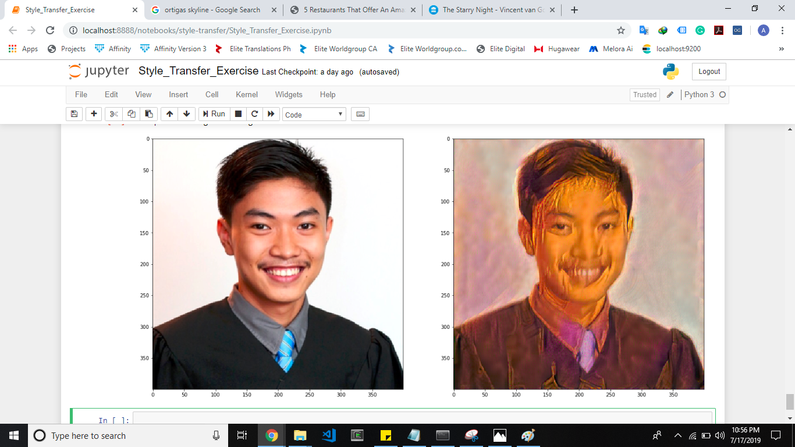

3. I saved a picture from the Internet of the Manila Skyline at night and Vincent Van Gogh's Starry Night painting. The result really is mesmerizing.

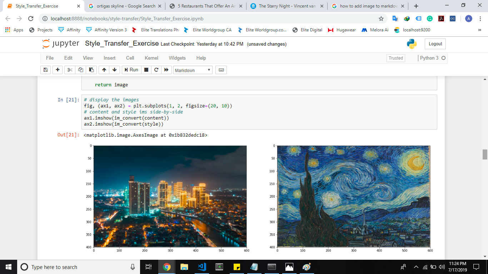

This is a really fun exercise and a great way to realize that Convolutional Neural Networks can do amazing things that are not limited to style transfers. Will definitely explore this field more.

&#35;60DaysofUdacity

Day 21:
----------
Milestones:

Participated in AWS Innovate Online Conference and followed the AI/ML track with the following courses:

1. Build business outcomes with AI and ML
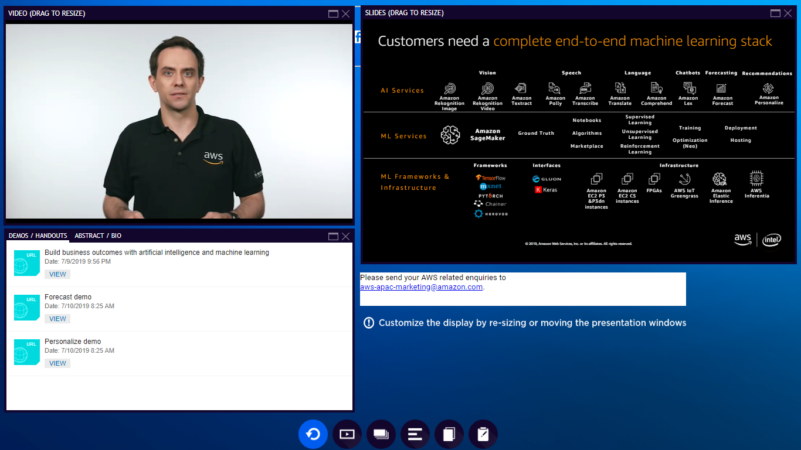

2. Open-source ML frameworks on Amazon SageMaker
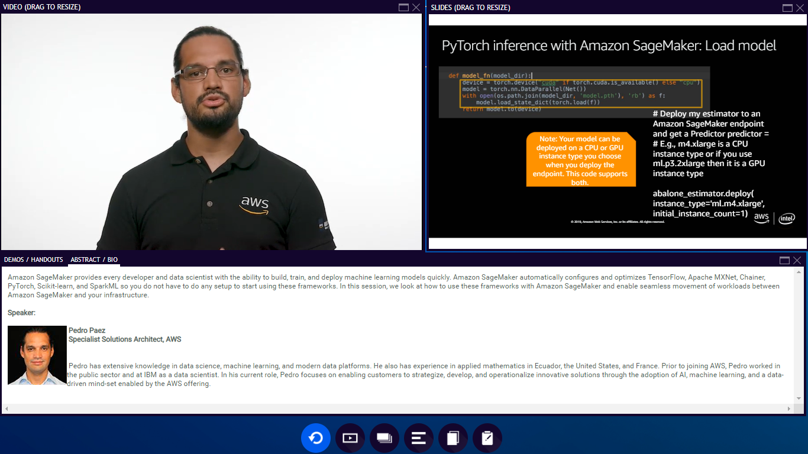

3. Accurately automating dataset labeling using Amazon SageMaker Ground Truth
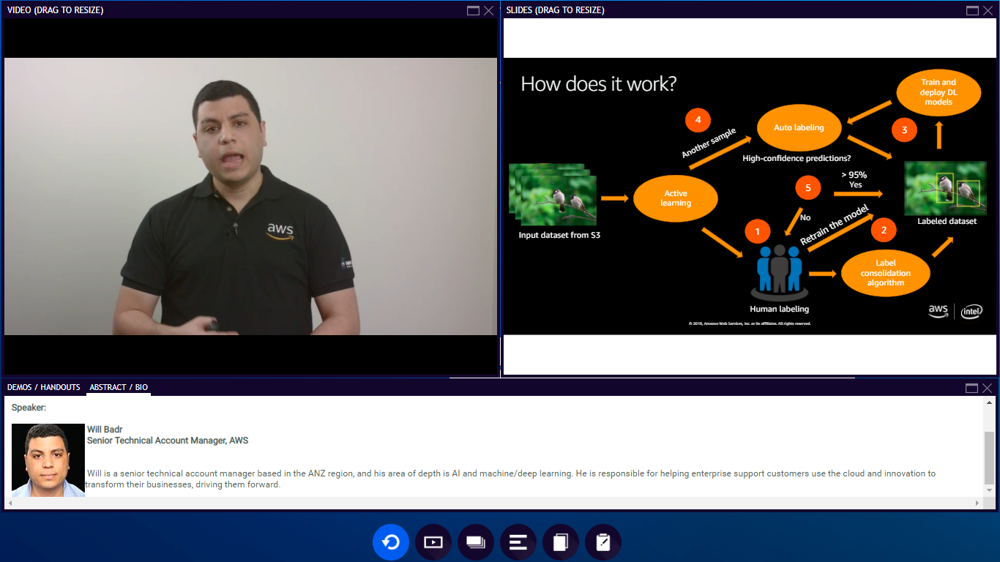

4. Reinforcement Learning with AWS DeepRacer and Amazon SageMaker RL
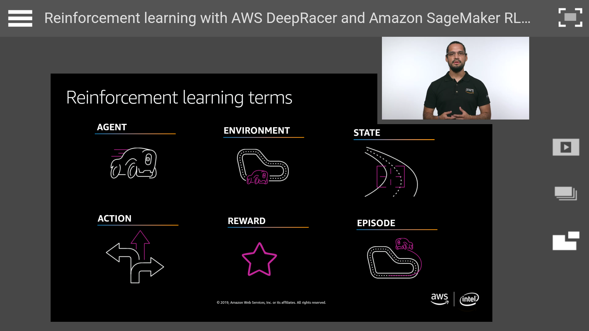

5. Image and video analysis with Amazon Rekognition and Amazon Textract
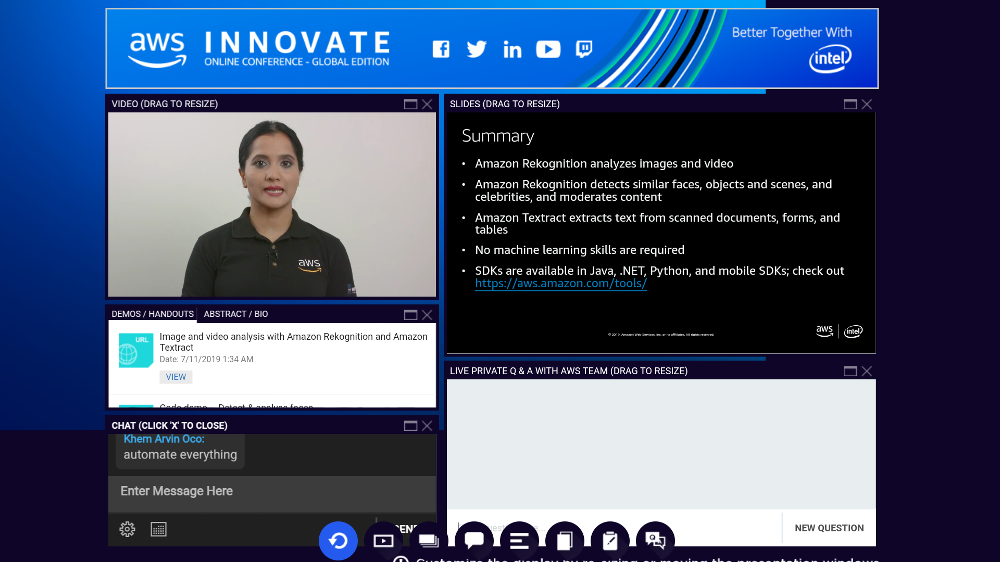

Got the attendee badge for participating in 5 required talks in the said conference.

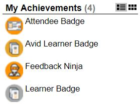

&#35;60DaysofUdacity

Day 22
----------
Milestones:
1. Started recurring neural networks and LSTMs lesson from Intro to Deep Learning with PyTorch.
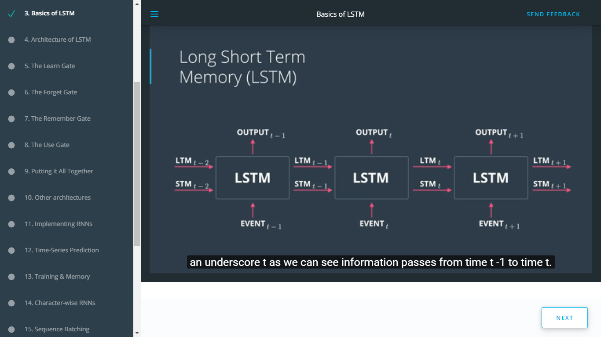

2. Partially perused several blogs about RNNs and LSTMs (will run through this tomorrow on a long travel). 

Learnings:
1. On the looks of it, Recurrent Neural Networks targets to sequentially learn features from a given dataset by using recursion, getting an input from the previously-trained layer.
2. Unfortunately, RNNs would fail when input features are not related to each other. Since we assume linearity between these inputs, inherent combinations of features that make up an insight and are arbitrarily separated from noise will be forgotten. These are called short term memory.
3. Also, RNNs suffer from vanishing gradients since updating weights using backpropagation is too cumbersome when we have multiple sequential layers.
4. To remedy this, they introduced LSTMs where layers have now the capacity to store important characteristics in long-term memory cell, update recently varied features as well as features characteristics that are unimportant to short-term memory.
5. Information stored to cells as well as the features will pass through different gates to keep important aspects, remove unimportant ones and spit out prediction as output to other LSTM layers.

&#35;60DaysofUdacity

Day 23:
----------
Milestones:
Previously, I studied the general overview of LSTMs and RNN being an extension of it. Today, I continued learning RNNs primarily the gates that make up LSTM on its general working form.
1. Learn Gate takes STM and an event in question by combining them through an activation function tanh and forgets part of it using an ignore factor with a sigmoid activation.
2. Forget Gate basically strips out unimportant information from LTM by multiplying LTM by a forget factor. Forget factor is calculated by using STM and Event Information in a mini neural network with sigmoid as activation function.
3. Remember Gate takes the newly-computed LTM coming out of the forget gate and an STM coming out of the learn gate, combining them together to output a new long term memory.
4. Use gate takes the newly-computed LTM from forget gate and newly-computed STM from the learn gate to come up with a new short term memory as an output. Generally, we just multiply these two outputs.

I understand that even on its general form, LSTMs are quite complicated and researchers on this area are making new schematics that best work on a particular applications. For now, my next steps would be to explore its applications using PyTorch.

&#35;60DaysofUdacity

Day 24:
----------
Milestones:
1. Finished the Recurrent Neural Network lesson of the Intro to Deep Learning with PyTorch
2. Simulated the power of LSTMs in a toy example Character Level Recurrent Neural Networks, training on my local machine.

Observations:
1. Training an LSTM model based on the default values presented in the solution IPython notebook in a machine with 7th Gen i7 processor and nVidia GeForce 940MX GPU takes a full 25 minutes.
2. The system generated a significant heat when training a model, with CPUs almost maxing out compute resources.
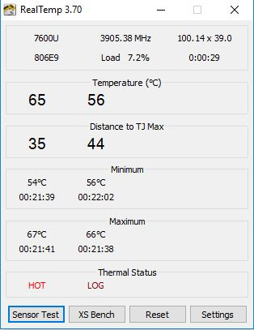

Realizations:
1. I have been into text prediction before but it is just a simple n-gram model that just maps a maximum of 5-gram tokens to the words being predicted. If no entries are there, it will just fallback to 4-gram, to 3-gram, etc. to get the next best word (pretty lame example for a so-called text-prediction app). I did not know that LSTMs would be much of use for this scenario where we would want to predict next word using character-level RNNs.
2. The results are pretty amazing given the fact that the model assembles real-English words. Although semantics are little off, I wonder how the model performs using real-world data, e.g. social media feeds, news coverage or blog posts.

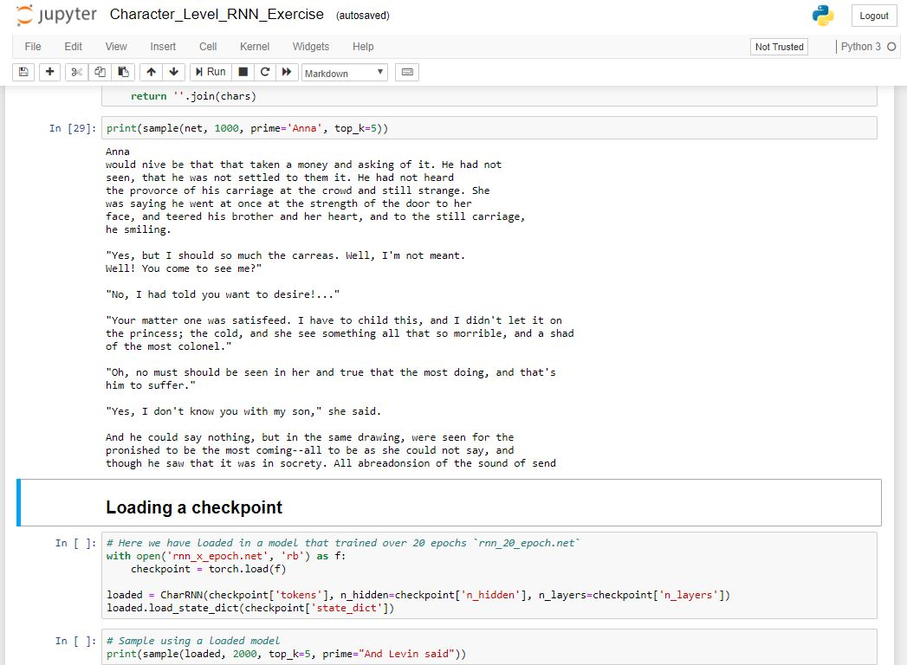

Learnings:
1. On Day 13, I learned that we should err on the side of a complicated model, then we improve our model from there. I did not know what that means until now that I trained an actual RNN with somewhat arbitrary hyperparameters proving that deep learning is also an art as well.
2. Some of the most common hyperparameters to consider are the following:
    1. number of LSTM layers (stacked) which is either 2 or 3
    2. number of units in the hidden layers
    3. the use of dropout layers and their probabilities.
3. From the complicated models with expectantly high values for each of the aforementioned hyperparameters, we start to play with these values to get the best model.

This is a rather long day for an introduction. But it is worth it nonetheless. Plus the fact that I won again in Boom with the Basics Challenge care of @Khush and @Jordi F. Thank you for selecting my answer.

&#35;60DaysofUdacity

Day 25:
----------
Milestones:
1. Reviewed sentiment analysis using a great resource from Julia Silge and David Robinson called Text Mining with R: A Tidy Approach. Evidently, this is not in Python but the simplicity of tidy approach in R has lead to the creation of a package that further simplifies text mining tasks such as sentiment analysis.
2. English language has three general-purpose lexicons that are based on unigrams quantified with scores for positive/negative sentiment, and also possibly emotions like joy, anger, sadness, and so forth. These are:
  1. AFINN from Finn Årup Nielsen
  2. bing from Bing Liu and collaborators, and 
  3. nrc from Saif Mohammad and Peter Turney
3. With these lexicons, the author has put Jane Austen's books into test by exploring each book's sentiment using the aforesaid lexicons. The progression of prositive/negative sentiments all throughout each book is beautifully plotted on the image below.

4. Created a GitHub project that stores smog images that will be used to create a model for smog detection, an initiative from the #sg_planetearth study group.

>https://github.com/ArseniusNott/SmogDetection

Motivation for learning sentiment analysis in R:
1. Since sentiment analysis as per Silge's book is dependent on general-purpose lexicons and now that I am exploring the penultimate chapter of the Intro to Deep Learning with Pytorch which concerns the same task, it would be interesting to compare how simple (in this case the book's implementation) vs complicated models (in this case the course lesson outcome) handle sentiment analysis.

&#35;60DaysofUdacity

Day 26:
----------
Milestones:
1. Finished the first half of Sentiment Prediction RNNs lesson of Intro to Deep Learning with PyTorch course.
2. Compare the R and PyTorch's way of doing sentiment analysis.
3. Add 20 sets of clear and smog images of highways as part of SmogDetection project from #sg_planetearth group.

Learnings and Observations:
Yesterday, I tried to review the sentiment analysis using R and its awesome tidy data principle, hoping that the knowledge I regained there would be helpful in my goal to understand sentiment analysis using deep learning methods. By the looks of it, here are the comparisons:

Using R:
1. In R, sentiment analysis is done by mathematically aggregating the scores of each word or token that dictates its magnitude of emotion (whether the token is positive, negative or neutral). They use popular lexicons (see the previous day for more details) as guide for scoring, then maps each of the words in the corpus and starts aggregating.
2. This technique is limited for a couple of reasons:
    1. Sentiment lexicons are significantly old that it may not capture the new words with their corresponding sentiments that is being used today (e.g. lit, dope, etc.)
    2. The emotion portrayed by each words in the lexicon can change based on its preceding tone or its preceding word (e.g. not happy, absolutely disgusted, gloriously wrong, etc.)
3. Even then, you can get instant feedback as to what is the general tone of the corpus through simple mappings that does not need deep learning models.

Using Python:
1. In training sentiment analysis in PyTorch, we must have a dataset that has labels in it that flags each corpus to either be positive or negative.
2. PyTorch will take advantage of LSTM architecture to learn from each input the words, essentially tokens that contribute to the output of the model (whether positive or negative).
3. Model returns the probability of the input being negative or positive [0:1] based on the learned structure of the LSTM layers.
4. Given all these, they have a couple of limitations:
    1. The veracity of the model depends on the quality of data (GIGO in a nutshell).
    2. A bit of overkill when you only need to get the tone of each input.
    3. Suffers from the curse of dimensionality when we want to encompass language's nuances (the more the data, the more accurate the model is) on the assumption that the data quality is good in the first place.

Given all these, it depends upon the scenario whether we prefer simple or complex models in doing sentiment analysis. The most important thing here is that we have options, and options are good! :)

&#35;60DaysofUdacity

Day 27:
----------
Milestones:
1. Finished the Sentiment Prediction RNNs lesson from Intro to Deep Learning with PyTorch
2. Learned about embedding layers as one of the powerful techniques in reducing dimensionality of datasets especially when dealing with text data.
3. Read this good article from Medium about sentiment analysis in Python that uses VADER, a lexicon and rule-based sentiment analysis tool for social media posts (link: https://medium.com/analytics-vidhya/simplifying-social-media-sentiment-analysis-using-vader-in-python-f9e6ec6fc52f). I did not account this in my comparisons yesterday but better late than never.

Learnings:
1. Embedding layers learn to look at the large vocabulary of unique tokens (in this case, words) and maps each word into a vector of specified embedding dimension. So instead of doing one-hot encoding which is a complete abomination especially when dealing with almost a hundred thousand input features, we take advantage of these layers to get specifically sized embeddings that we then use to map when we need the original data, sort of like a lookup table, or dictionary if you will. 
2. Binary cross-entropy is just a simplified version of the categorical cross-entropy where the loss computed for every output vector component is not affected by other component values. That independence has lead us to limit the output to just one value, a measures of how far away from the true value (which is either 0 or 1) the prediction is for each of the classes.

Lastly, for the third time in a row, I won again in the Boom with the Basics challenge. Moderators selected my explanation of ensemble methods as the top answer:

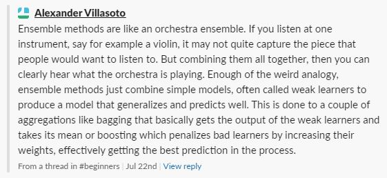

&#35;60DaysofUdacity

Day 28:
----------
Milestones:
1. I am so excited to tell that I finished the Intro to Deep Learning with PyTorch course.

2. On this day, I learned how PyTorch models are being serialized and then loaded into C++ runtime using simple annotations and functional imports.
3. Explored architectural decisions as to how PyTorch models will be utilized in prouction using the tools that I am most comfortable with.

Learnings and Future Plans:
1. C++ is the production runtime environment that is selected by PyTorch since it is the fastest and most widely utilized platform. 
2. Also, as most other languages are just abstraction of C++, it is wise to couple PyTorch with the said language, minimizing the need to utilize multiple interfaces which will significantly affect production performance. Don't take it from me, take it from Christian S. Perone's blog post here:

> http://blog.christianperone.com/2018/10/pytorch-1-0-tracing-jit-and-libtorch-c-api-to-integrate-pytorch-into-nodejs/

3. Having said that, limitations of C++ arise. With so much solutions that give flexibility in implementing web API interfaces in the open-source market, C++ could not just be the best solution. That is why in my future projects, I will be working on Node.JS, one of the best asynchronous web frameworks out there that make it easy for developers to expose API endpoints for production.
4. Although Node.JS has quirks that I am not really fond of, we primarily use that in our organization to create web systems so learning curve would not be an issue.

But before the project, I need to refresh my memory on Secure and Private AI course having Intro to Deep Learning with PyTorch as my guide.

Bonus: I recently got my certificate in the recent AWS Innovate 2019 Online conference. 

&#35;60DaysofUdacity

Day 29:
----------
Milestones: 
1. Since I am done with the Introduction to Deep Learning with PyTorch, I am now starting chapter 2 of the Secure and Private AI challenge.
2. Read Chapters 1 and 2 of 'The Algorithmic Foundations of Differential Privacy' by Cynthia Dwork. It turns out that the main goal of differential privacy as explained by Andrew Trask can comprehensively be understood by reading them.
3. Modified my SmogClassification dataset by removing images that does not have highway objects in them.

Learnings:
1. It is mostly difficult for AI researchers to utilize datasets with public or private information in them especially when they came from sources that are not readily available due to their confidentiality or companies have market edge in witholding them. Thus the tasks of making these datasets available for researchers are often difficult.
2. Reviewing the definitions presented by Andrew Trask about preserving privacy, researchers need two things - (1) secure the protection of individual information involved in the dataset and (2) let them report their results without compromising private information.
3. The second aforemention requirement can be hard to implement especially when results can be accidentally or intentionally attributed to initial dataset. Thus common anonymization techniques does not work.
4. Ultimately, by Dwork's careful delineation of privacy requirements, we now have a framework that suggests a promise that individuals are protected while researchers are free to communicate their results.
5. The goal of this promise is that if we have some private or sensitive parameters, we are concerned on tools and techniques that can be applied in order to get the best of both worlds, information security and freedom to initiate and communicate findings of statistical analyses.

It is a long day, but worth it nonetheless.

&#35;60DaysofUdacity

Day 30:
----------
Milestones:
1. Finished Lesson 3: Introducing Differential Privacy of the challenge course.
2. Finished the video by Bolun Wang of UC Santa Barbara titled 'With Great Training Comes Great Vulnerability: Practical Attacks against Transfer Learning'.
> https://www.usenix.org/conference/usenixsecurity18/presentation/wang-bolun

Learnings:
1. Although transfer learning significantly cut the cost of rerunning models to enormouse amounts of datasets, AI researchers have very limited choices of these models also because of the said problem (only companies like Google that invest in models that can be democratized for our use). 
2. With this dilemma, a lot of models will be based on these limited amounts of parent/teacher models, so this limitation is taken advantage by attackers.
3. Several attacks include:
    1. Adversarial attacks - intentional misclassification of inputs by adding carefully engineered perturbation on data.
    2. White box attack - assumes full access to parent model internals which enable attackers to find optimal perturbation offline.
    3. Black box attack - a brute force method that repeatedly query the model to extract meaningful model insights that can be used to rig datasets that will then perturb model's normal output.
4. With Wang's team efforts, they devised a unique attack that goes in the middle of teacher model and student models.
    1. The end goal is to mimick hidden layer representations of model by slightly deviating from the ground truth so humans can't identify they are being attacked
    2. This is done by adding fingerprinting (perturbation to input features) attacks to parent models. These are essentially extra features acquired from publicly available models overlaid to datasets.
5. Scarily enough, these form of attacks expose vulnerability to datasets that we use in the course challenge (ie ImageNet).

This I think is a complement of differential privacy. That we must not prioritize exposing public information but also make sure that our models are resistant to these attacks. Fortunately, in spirit of fair research, the results were communicated to companies like Google, Microsoft and Facebook and they are now streamlining changes to make teacher models robust.

This marks the first half of #60DaysofUdacity and it is really awesome so far!

&#35;60DaysofUdacity

Day 31:
----------
Milestones:
1. Finished Lesson 3: Evaluating the Privacy of a Function (short but tricky one)
2. Tried to install syft on my local machine to no avail because of Microsoft C++ Build Tools dependency that is somehow cost 1 gigabyte download. Will try to fix this later.

Learnings:
1. Ultimately, we are interested in the sensitivity accounting for all the attributes associated to each individual rather than considering each of the attribute's sensitivity individually. In other words, we are concerned about people's privacy by looking at each row representing a person rather than looking at each of the variables.
2. I tried to understand thr threshold metric in this chapter only to understand that it is just to build our intuition about variable databases with varying sensitivities. My takeaway is this:
    1. Threshold is just an intuitive way of telling us that the empirical or constant sensitivity of a function that is applied to a database is not an accurate estimate. Because as Andrew Trask simulated, there exist some databases that may or may not be sensitive to change. By  comparing the number of sensitive PDBs to the threshold, we can see that some are sensitive and some are not thus proving thta the sensitivity metric is database specific.
    2. There is a threshold check in differential attacks because first, it works. You can find the difference of a query applied to a database with one removed vs the original query by any function really, could be sum, could be mean or for the sake of example, could be threshold.

Let me guys know what you think.

&#35;60DaysofUdacity

Day 32:
----------
Milestones:
1. I came across this whitepaper from Microsoft entitled Differential Privacy for everyone. This is one of the best papers that delve into the introduction to differential privacy. You can download the whitepaper in the following link:
>http://download.microsoft.com/download/D/1/F/D1F0DFF5-8BA9-4BDF-8924-7816932F6825/Differential_Privacy_for_Everyone.pdf

Learnings:
1. The use of the word anonymous in the context of protecting people's information simply by slightly modifying values in the database is incorrect. The term should be used in this case is de-identification which means that the data curator only removes information which could easily be mapped to the real identity of individuals that the data refers to.
2. Many organizations devise de-identification techniques but oftentimes, too much modification of the data will be difficult for researchers to find meaningful insights from the available data just because we de-identified the database too much.
3. Under the Differential Privacy model, researchers must not have access to data directly. They must communicate with a middleware or some sort of API that spits out query results with minimum amount of distortion without any opportunity for unwanted re-identification.
4. Distortions are intentional inaccuracies applied to the database that can be calibrated by getting the sweet spot of it being small enough that it will not distort the ground truth or insight retrieved from query but large enough that malicious queries will not have a chance of leaking potentially private information through unwanted re-identification.

With Microsoft's proven domain in database and big data solutions, from their products like MS SQL and Azure, it is imperative that they must adopt this strategy head on. Fortunately, they have Cynthia Dwork which surprisingly is a Microsoft distinguished scientist and one of the collaborators of the PINQ project, a Microsoft-created differential privacy middleware based on LINQ. Really amazing stuff guys. Check it out.

PS. For the fourth time, I won again in Boom with the Basics. 

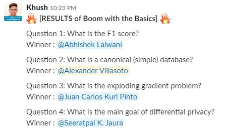
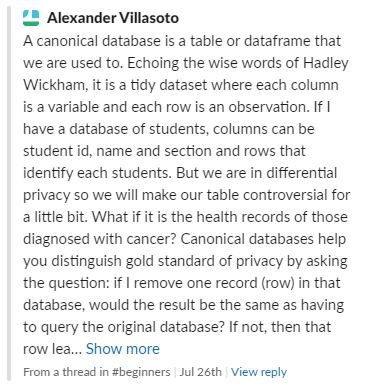

References:
1. [Database Privacy: Microsoft Research](http://research.microsoft.com/en-us/projects/databaseprivacy/)
2. [Privacy Integrated Queries (PINQ):](http://research.microsoft.com/en-us/projects/PINQ/)

&#35;60DaysofUdacity

Day 33:
----------
Milestones:
1. Last night, about 12:15 A.M. in the Philippines, I resisted the urge to sleep to join my talented peers at #sg_dl-goodfellows in a really fruitful discussion of the first three chapters of Ian Goodfellow's Deep Learning book. We talked about many things, succinctly summarized by @Shivam Raishama here:
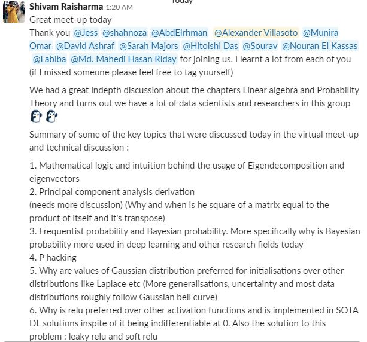

And our post-meeting selfies:
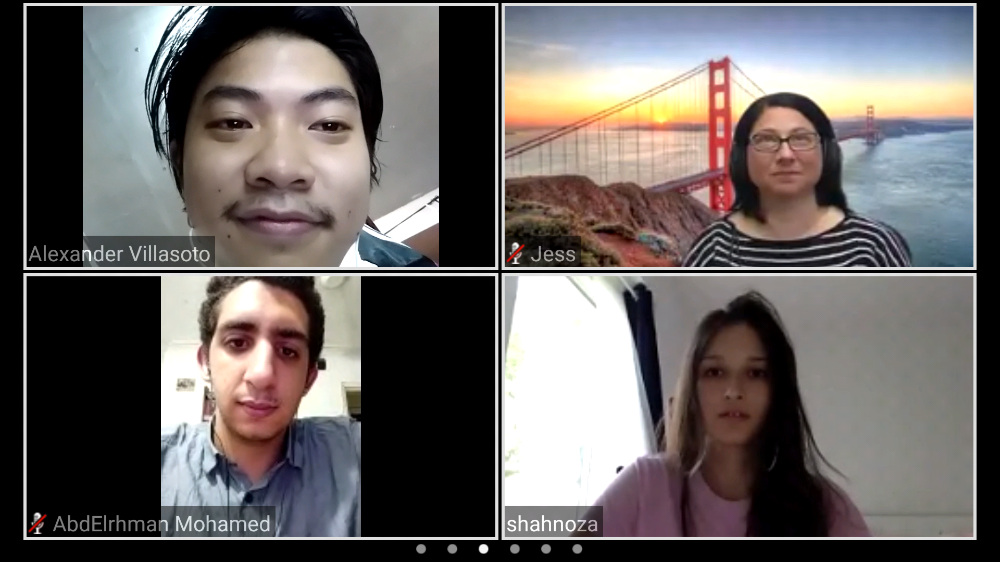

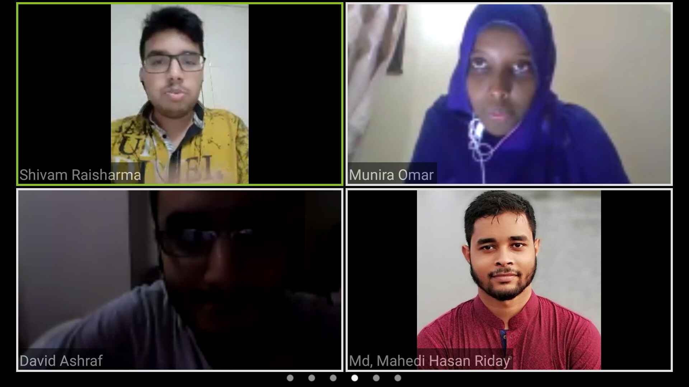

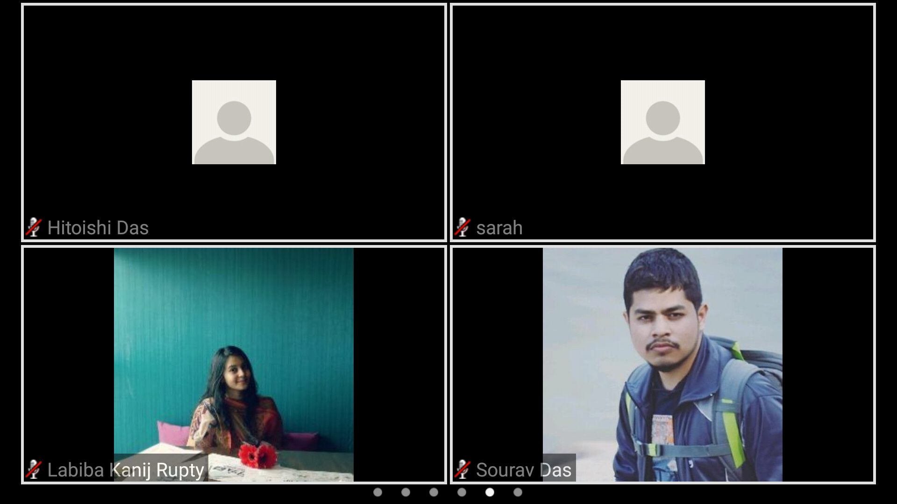

2. Added 30 pairs of images in my SmogDetection dataset.

Self Reflection:
I used Slack in my work. For publishing announcements and communicating with the rest of the team. Nothing more than a communication tool. I could not imagine that Slack could be more than that. A virtual space conducive to learning with inspiring people keeping you motivated every time. 

&#35;60DaysofUdacity

Day 34:
----------
Milestones:
1. Completed Local Differential Privacy part of the course.
2. Reread the second chapter of Algorithmic Foundations of Differential Privacy

Learnings:
Randomized Response to protect individuals and the sampling itself to the burden of plausible deniability. Randomized response is not really tightly coupled with differential privacy per se. But with Cynthia Dwork's outstanding intuition, she masterfully used the technique of randomized response as key to understand local differential privacy via proof of example. The intuition that I got here are:
1. RR protects people by giving them a choice to tweak their responses a little bit which is similar to adding noise in LDP.
2. With Randomized Response's sampling mechanism in mind, we can prove through simulation that:
    1. We can achieve differentially private queries by outputing generalizable results and not specifically sensitive ones.
    2. Even with a data that is not evenly distributed or skewed at some point, we can still do differentially private queries and obtain or extract the statistic that we need.
    3. The more the data, the more differentially private the database is. This means that the queries are returning the general insights in data rather than information local to a particular user. Thus in essence, people's privacy is preserved.

What about the challenges?
1. In the examples presented both in Trask's videos and Dwork's books, normality is assumed and it is imperative that we must know the ground truth in order to get back the original statistic that we want to know. So parameter estimates must be considered.
2. This leads to a couple of problems ever present in the frequentist's view of statistical analyses - Too Many Assumptions.
3. As an added challenge, we have noise. Quantifying and transforming it to the original distribution can be difficult.

As if Cynthia Dwork does not anticipate these sets of problems, she published this paper Differential Privacy and Robust Statistics that addesses these problems in a differential privacy setting.
> www.stat.cmu.edu/~jinglei/dl09.pdf

This is a little Mathy so I stopped reading it (sorry :D). But I perused this manuscript which is more layman friendly and tackles solution to the set of problems I encountered. This is titled Statistical Approximating Distributions under Differential Privacy
>https://journalprivacyconfidentiality.org/index.php/jpc/article/download/666/660/

God I hope I could meet her someday!

&#35;60DaysofUdacity

Day 35:
----------
Milestones:
1. Finished Lesson 5: Introducing Local and Global Differential Privacy.
2. Watched Cynthia Dwork's talk from the Differential Privacy Symposium: Four Facets of Differential Privacy
> https://www.youtube.com/watch?v=lg-VhHlztqo
3. Watched the Formal Definition of Differential Privacy by Lê Nguyên Hoang
> https://www.youtube.com/watch?v=cNoiuVne3j4

Learnings:
1. Local differential privacy achieves individual privacy for every participants in the study at the expense of accuracy. Also, LDP needs more data or more participants to achieve accuracy. That is why in cases that these are not met, our resort is Global Differential Privacy.
2. Simply speaking, this protects the output of the query itself by adding in it an estimated noise. Enter the formal definition of DP which goes like this (please look at the disclaimer below :D):

> Algorithm that analyzes datasets, let's call it M gives epsilon-differential privacy if for all pairs of datasets x and y differing in the data of one person, and every possible output S, the probability of observing S when we run the algorithm M given that we have the complete database is almost the same as it is at most e to the epsilon times the probability of observing S from the algorithm given a dataset with one item removed.

3. So the ratio of the two given probabilities is at most e to the epsilon. Thus here, epsilon is our measure of privacy loss.
4. x, y pairs here are adjacent datasets or parallel databases with one being complete and one with one item removed (as if this is not clear enough).

Advantages of Differential Privacy:
1. Assuming that implementations agree on the same formal definition, DP is future proof in a sense that the statistic that you obtained does not change even when the person gets new insight from another dataset.
2. Since differential privacy protects an individual in the study, then by formal definition, the same is true for other individuals within the study.
3. Algorithms that analyzes datasets when differential privacy is applied can be accumulated (the notion of privacy budget will be explored later).
4. Differential privacy is programmable as we have seen in the Trask's simulation challenges.

As Cynthia Dwork puts it, we have truth and a blurred version of truth and the blurred version of truth tells you the whole story in that it tells the generalizable feature of the truth. Of course we are talking about differential privacy here. This claim would be controversial if used in a different context. :D

Disclaimer: Instant feedback for those who think this is not accurate enough and we'll favor accuracy by limiting noise accordingly. :D

&#35;60DaysofUdacity

Day 36:
----------
Milestones:
1. Finished the Differential Privacy for Deep Learning.
2. Prepared my system for the final project, details will unfold soon :D

Learnings:
Two pivotal challenges when considering differential privacy in deep learning:
1. How do we compute sensitivity when models are not the same as canonical databases, meaning that parameters like augmented databases, simple queries, and sensitivity metric will not be appropriate in this case?
2. Even if we know the answer to question one, does the algorithm have a definite/predictable outcome?

Solutions:
1. Here are the steps to translate fundamental definition of DF in the context of the basic classification algorithm:
    1. You consider output of multiple training models kind of like database rows. 
    2. Augmented database in this context will be all training model labels as x and all training models but with one removed as y.
    3. The differentially private query that we will do in this case is a max function.
    4. Add a Laplacian noise to the output of the query that adheres to the privacy constraints (epsilon, delta). 
    5. Since we have the augmented labels already, we can do PATE analysis to compute privacy leakage (more on this tomorrow).
2. The output of this differentially private query will be the ground truth and basis/labels for the local classification model. This assumes that the scenario is the classification algorithm has no labels and must depend on databases that would leaks private information.
3. Interesting Note: Outputs of epsilon-differentially private queries will be immune to post-processing. Meaning that no amount of further processing to be done in the differentially private outputs that will uncover specific information from the dataset.

&#35;60DaysofUdacity

Day 37:
----------
1. Added another 30 sets of images for the SmogClassification dataset as requirement for #sg_planetearth study group.
2. Attended a meetup set by @Shudipto Trafder to clarify requirements for gathering images for the SmogClassification project.
3. Watched the last 2 videos fro lesson 6 of the course challenge, Differential Privacy at Apple and Privacy and Society from OpenAI.

Reflections:
I had an amazing discussion with @MarianoOG about his question - 'Do we really care about privacy?' while also pondering several questions raised from the videos I watched. 
1. What are realistic standards for private machine-learning or privacy protecting approaches to data analysis in general.
2. When are we willing to pay the extra costs in terms of convenience or computing overhead in order to have greater privacy protection?
3. Who is best fit to help people manage their data? Companies? Governments? Non-profits? How can we best hold them accountable.

To which my answer would be:

All the more reason why we should act now. The primary factor is the ignorance of the people when relenting information and the legislators, apparently having no idea what all of this is about, where they should act upon the issues of leaked privacy in utmost responsibility. Have you watched Mark Zuckerberg's interview with congress? Even the most simple ad revenue as Facebook's business model they cant grasp.
Given those problems, Dwork proposed a solution and its primary goal goes something like this - Ok, since terms of privacy are pretty lax, people just agree on things just for convenience, government not being technical about their decisions, maybe we can do something, a strategy, like a promise to protect people without them knowing the details to limit data companies like the recent fiasco of Cambridge Analytica to know data points unique to each person and exploit them for their purpose. And that strategy is differential privacy.
EU's GDPR adopted this strategy and imposed rules and sanctions to companies. And the good thing about this is it's working. Companies like Apple, Microsoft and Google are on the moves to comply. Even Facebook, who sponsored this challenge to train future developers and AI practitioners in observing differential privacy. How about the recent news where US government fines Facebook 5 billion for data breach? This news is something. Companies now are taking measures to be compliant because fines like that hurt their businesses significantly.
I know it is frustrating and kind of like an overdue cure to an old problem. But we need to act now, for the protection of people. The promise of differential privacy couldn't be more true and relevant in this case.
To answer the question, people may not care but tech companies do, because they are obligated to do so.

It is nice when things worked out. 

And hey, here are the pictures of our meetup. 

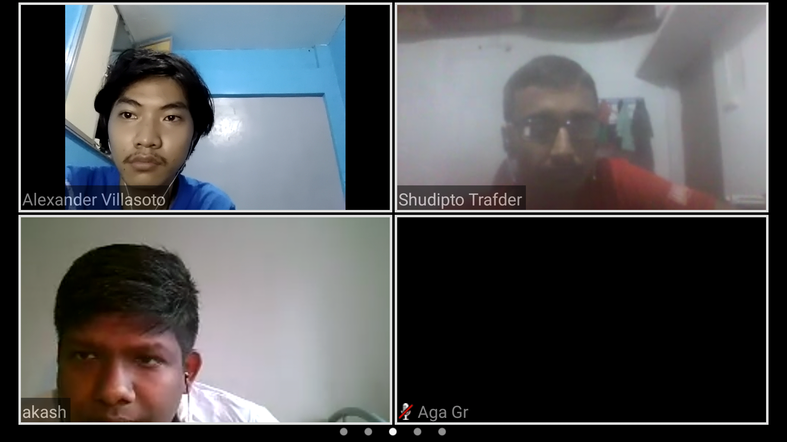
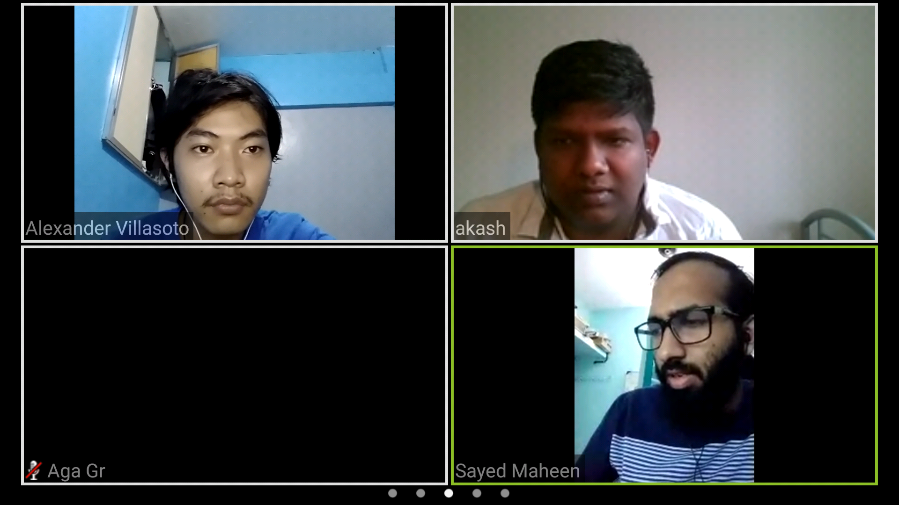
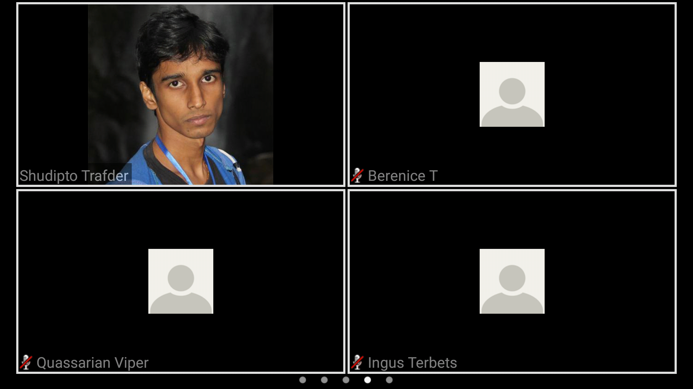
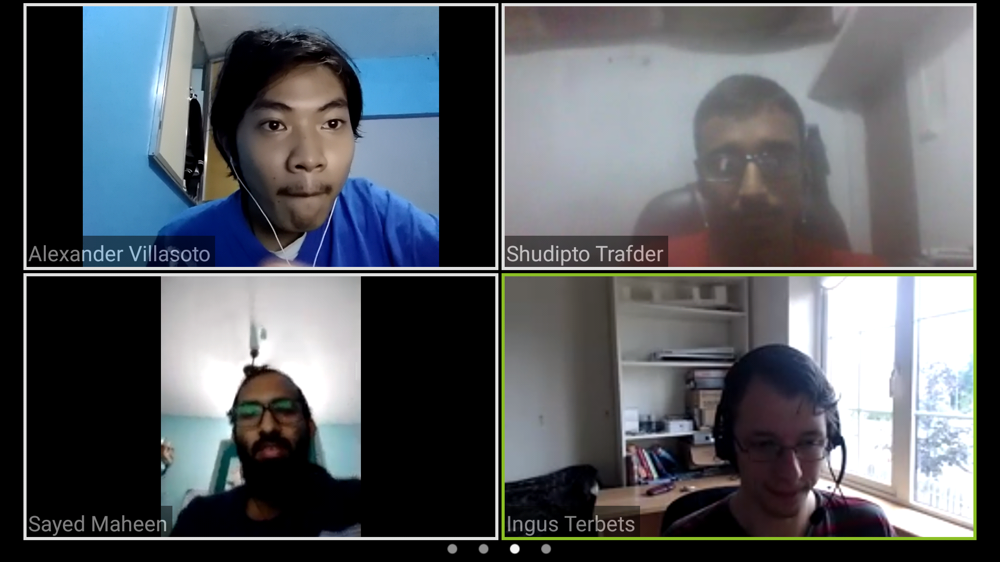

&#35;60DaysofUdacity

Day 38:
----------
Milestone:
1. Finished the PATE analysis project. This took a lot of my time since I am only running my models on my local machine. Unfortunately, CUDA experience errors in my machine.

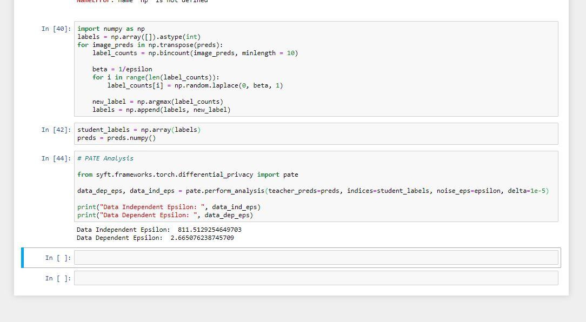

Learnings:
1. As I have said yesterday, differential privacy has a different way of computing sensitivity in that when it is being applied or translated to deep learning models may leak information in spite of them being aggregated ones. 
2. The idea behind PATE is applying an aggregation on output of models that are sensitive in nature (i.e. models that uses private data), called "teachers". 
3. With this, we are interested in their outputs or labels that must be aggregated using a function.
4. Since that function returns a majority label, we need to add noise (mostly Laplacian) to prevent the aforesaid leakage of aggregated information across private models.
5. The aggregated result will be used for training another model and use the labels from the teacher models in the so-called student models.
6. PATE analysis has this nifty trick of computing the level of agreement between different teacher models.

This is really a stretch and an added friction for training models as simple as MNIST but that is what you pay for achieving privacy. I learned a lot about this project.

&#35;60DaysofUdacity

Day 39:
------
Milestones:
1. Attended meetup hosted by @Ateniola Oluwatobi Victor. We discussed global differential privacy particularly on how to approach PATE analysis final project.
    a. This meeting has cleared my confusion about properly splitting MNIST's test dataset. Apparently, 90/10 split is just arbitrary. 
    b. Met with these amazing people @akshu18 @Archit @Raunak Sarada @Ayush Yadav @Jess @Gogulaanand R, @erinSnPAI @Seeratpal K. Jaura @Sourav @Nishant Bharat @Ivy @Jaiki Yadav@Suparna S Nair @Jeremiah Kamama @Ebinbin Ajagun @Tracy Adams @nabhanpv

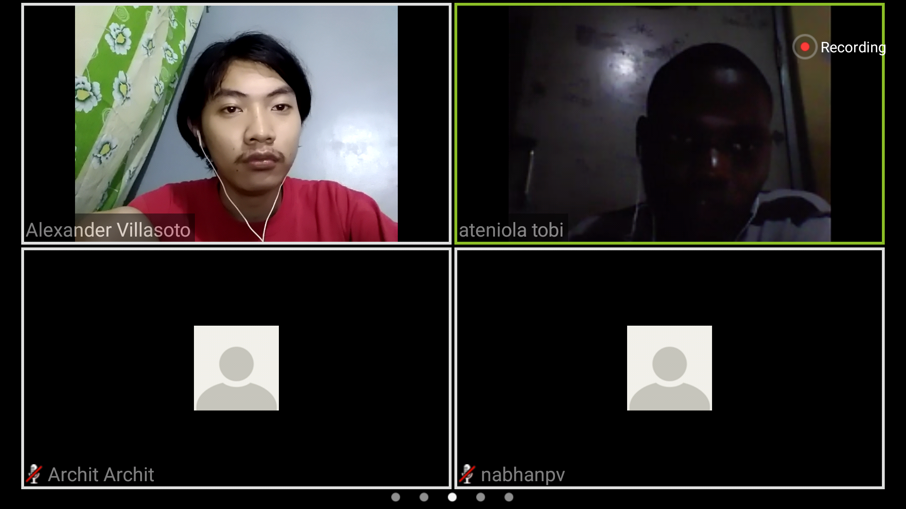

2. Attended meetup hosted by @Stark from #sg_novice-ai.
    a. Brainstorm on projects that is geared towards healthcare.
    b. Recommended strategies on how to plan ahead based on time constraints. It is short but a really fruitful meeting. Plus I finally met people that I really look up to in the challenge - @Seeratpal K. Jaura @Stark @Hung @Archit @Oudarjya Sen Sarma @ayivima @Ingus Terbets @cibaca @Apoorva Patil @Agata [OR, USA] @Shudipto Trafder

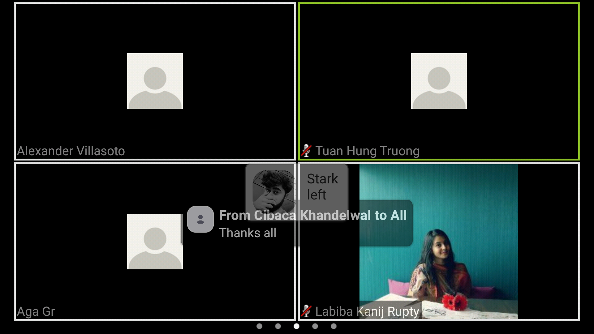

PS. For the 6th time, I won again in the Boom with the Basics Challenge care of @Khush and @Jordi F. The question is - What is One Hot Encoding?

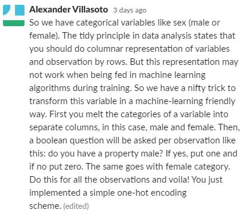
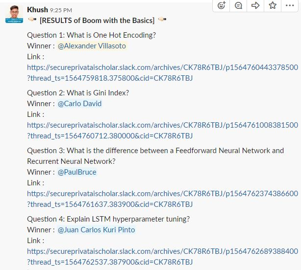

&#35;60DaysofUdacity

Day 40:
------
Milestones:
1. I finished Lesson 7: Federated Learning lesson of the challenge and will target to do the final project tomorrow. 
2. Read the paper about the Development and Validation of Deep Learning Algorithms for Detection of Critical Findings in Head CT scan as a candidate dataset to be used in the final project for #sg_novice-ai. You can access the paper here:
> https://arxiv.org/abs/1803.05854

Learnings:
With so much intuition that I generated towards learning the previous lessons from sensitivity and formal definitions of differential privacy to differential privacy in the context of deep learning, a great addition would be federated learning.
I happened to work with next word prediction using bag-of-words, specifically the n-gram model. I did not know that GBoard uses federated learning to improve next-word predictions to an almost haunting degree :D. With so much going on in our edge devices, the use of federated learning to improve mobile user experience cannot be overstated.
But it is important to establish what federated learning is first:
1. It is a specific environment for machine learning where the actual training of model is somehow democratized to multiple machines (edge devices) instead of the usual centralized modeling on a single one. 
2. This limits access to local data across multiple users that would normally be submitted to the central server for modeling. 
3. In this case, sensitive information from users stay within the users' devices.
4. These machines will then train their mini models and outputs aggregated version of the data called focused update. 
5. With the power of differential privacy, these updates are then augmented with noise so even these aggregates will not leak private information (more on this on the next lesson).

With PySyft, orchestrating modeling across multiple remote devices are really easy since it is tightly-coupled with PyTorch. I am really excited to try it myself tomorrow. 

It is really fun to give motivations to and be encouraged by the amazing people in this community. With that, I extend my encouragements to you all.

&#35;60DaysofUdacity

Day 41:
------
Progress:
1. Not necessarily a milestone but a roadblock that I encountered during my attempt to the final project for Federated Learning lesson made me realize few things:
    1. Using function definitions to tensors that are sent to the remote worker must also be also be sent to it.
    2. Primitive functions like enumerate does not work on tensors located remotely (I have to confirm this tomorrow).
2. Learned that PATE analysis toolkit of PySyft only accepts probability values (with domain 0-1). Apparently, delta values beyond that generates negative Data-Dependent Epsilon which does not make sense since it returns 0 at the minimum, meaning teacher models agree on their resulting predictions.

I did not finish the project today due to the aforesaid roadblock but I think I can manage to pull it off by tomorrow.

I am really happy to extend my sincerest motivation to all of you that are actively sharing your progress for this challenge. By reading your awesome learnings, you keep me motivated. Keep rocking guys!

&#35;60DaysofUdacity

Day 42:
------
Milestones:
1. I participated in a meetup that is more than 2 hours long as part of the #sg_novice-ai showcase project creation. 
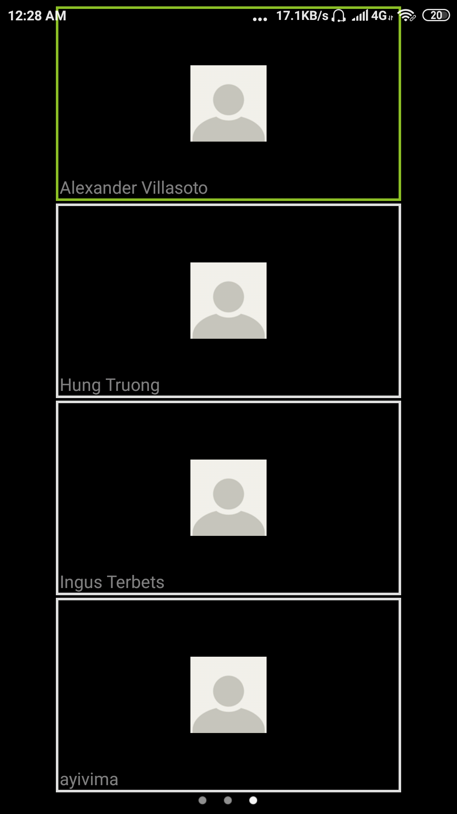
With almost no initial progress, we managed to achieve the following:
    1. Discuss candidate datasets to be used in the project that is geared towards healthcare
    2. Selected the dataset that we can actually implement deep learning project with and 
    3. Discussed the plan of action from there like sampling and preprocessing techniques
2. I finally finished the federated learning project. It is amazing how how federated learning can be used on use cases where you want to distribute training across multiple remote edge devices. The issue right now is on how to secure the focused updates that are accumulated by the master aggregator, encrypting communication in the process. This will be a topic of the next lesson.

I am really happy to extend my sincerest motivation to all of you that are actively sharing your progress for this challenge. By reading your awesome learnings, you keep me motivated. Keep making your progress guys!

&#35;60DaysofUdacity

Day 43:
------
Milestones:
Another busy day for us at #sg_novice-ai. We held another meetup where we cleared up several things:
1. Downloading a large dataset for chest x-ray, a little over than 44 Gigabytes of collective zip files, extracted into one image folder for processing.
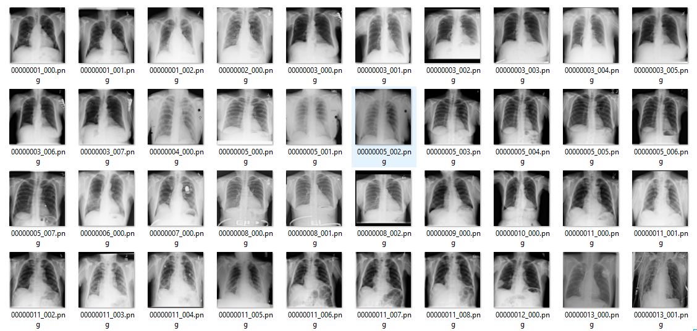
2. I created a scripts for filtering datasets that we need and separating images on their respective classes.
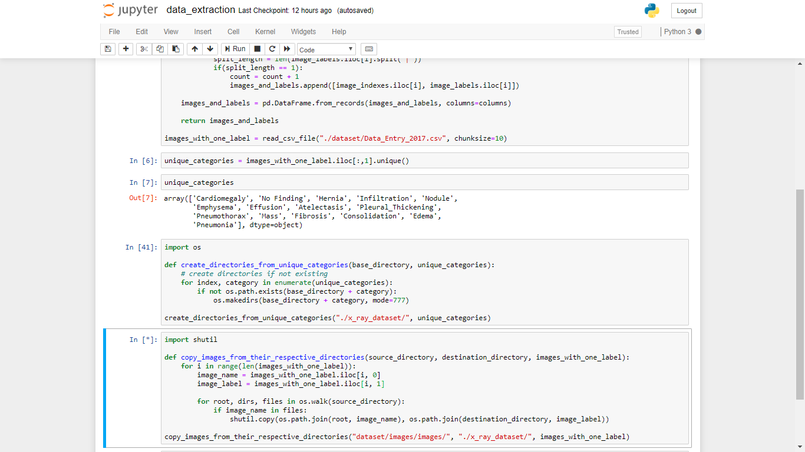
3. Decided on functional groups to run end-to-end pipeline mainly - (1) pre-processing, (2) data acquisition and preparation, (3) Modeling, (4) Deployment and (5) Documentation.

Due to my work as well as my duties in the project showcase, I failed to continue my progress in the course challenge. Hopefully, I will be able to finish the course soon along with the projects. Wish me luck.

Here are the images in our meetup:
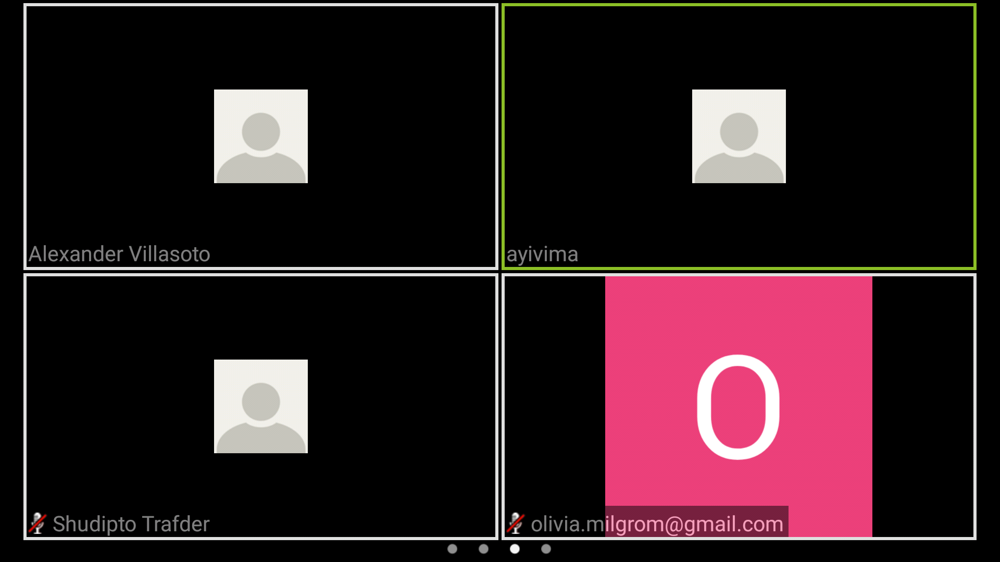
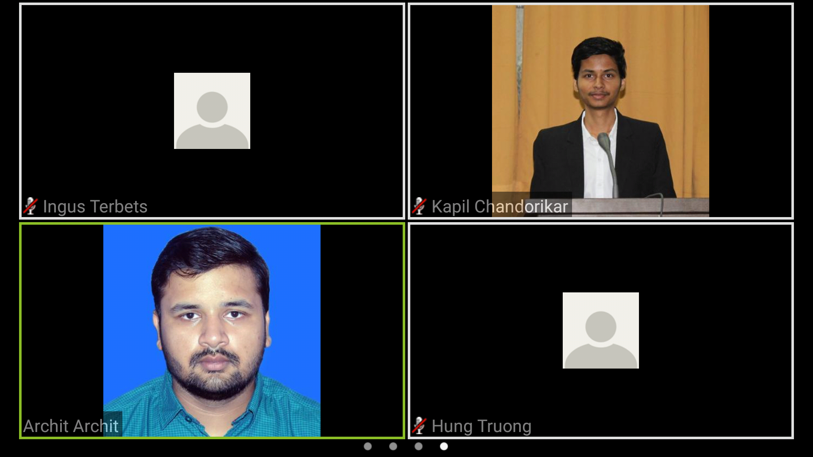

I am really happy to extend my sincerest motivation to all of you that are actively sharing your progress for this challenge. By reading your awesome learnings, you keep me motivated. Keep making your progress guys!

&#35;60DaysofUdacity

Day 44:
------
Progress:
1. Worked on Google Colab to enable my teammates to use the dataset without having to download or rerun the script which took a lot of time (even on Colab's compute standards).
    a. It is not finished yet, so I might need to wait the Colab on its runtime before I sleep :D
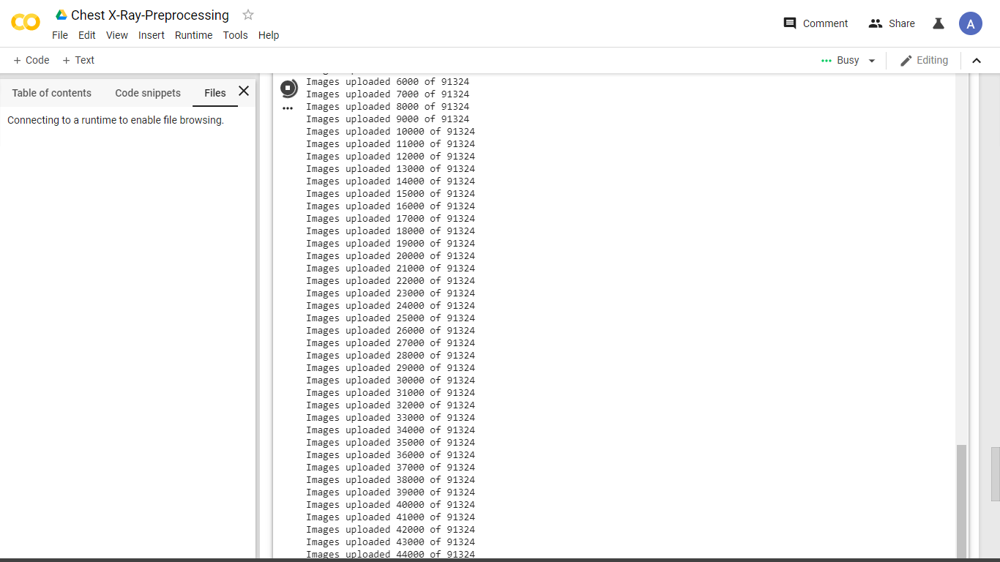
2. Setup the Google Drive API to actually upload the images returned by my script.
3. Setup my local machine to initially model the SmogDetection project. Google Colab is busy now for the #sg_novice-ai project so I cannot use both of those.

I am still at the Encrypted Learning lesson and does not have any meaningful progress in the challenge course. Just wait guys, I will be there. I have 9 days left. :D

I am really happy to extend my sincerest motivation to all of you that are actively sharing your progress for this challenge. By reading your awesome learnings, you keep me motivated. Keep making your progress guys!

&#35;60DaysofUdacity

Day 45:
------
Milestones:
1. I finished the data preparation for Chest X-ray images in their respective directories using Google Colab. I used Kaggle API to download the dataset.
2. I also uploaded the dataset in my Google Drive which took 81 Gigabytes of storage. Thankfully my organization allows for unlimited storage so all is well.
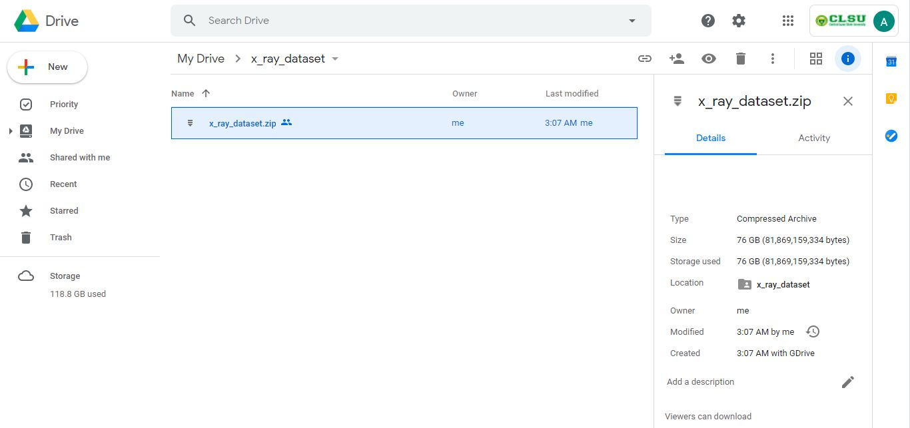

My goal here is to minimize their need to redownload and re-run data preparation script which in this case took hours to run. I hope my teammates will make use of it in their modeling process.
The script is here: https://github.com/ArseniusNott/60DaysofUdacity/blob/master/Chest_X_Ray_Data_Preparation.ipynb

I am really happy to extend my sincerest motivation to all of you that are actively sharing your progress for this challenge. By reading your awesome learnings, you keep me motivated. Keep making your progress guys!

&#35;60DaysofUdacity

Day 46:
------
Milestones:
1. I participated in #sg_novice-ai and I am super pumped about our progress. Wetalked about how we go from data preparation to preprocessing as well as the sampling techniques, classes selection and modeling parameters.
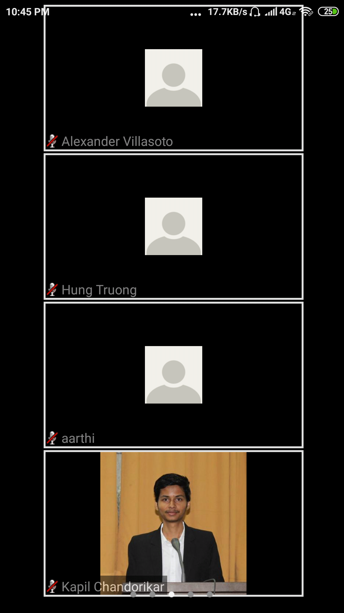
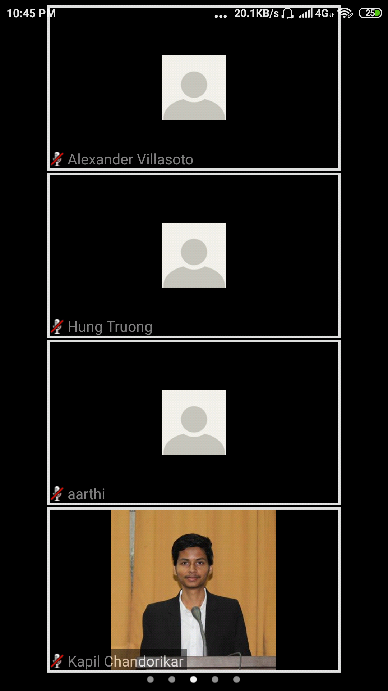
2. Finished half of the encrypted learning lesson. Will definitely finish the whole lesson tomorrow. As for the summary, I will post it in my progress tomorrow. 
3. Good news, our paper was recently submitted for review. I am hoping for positive comments from technical reviewers. I wish my team all the best!
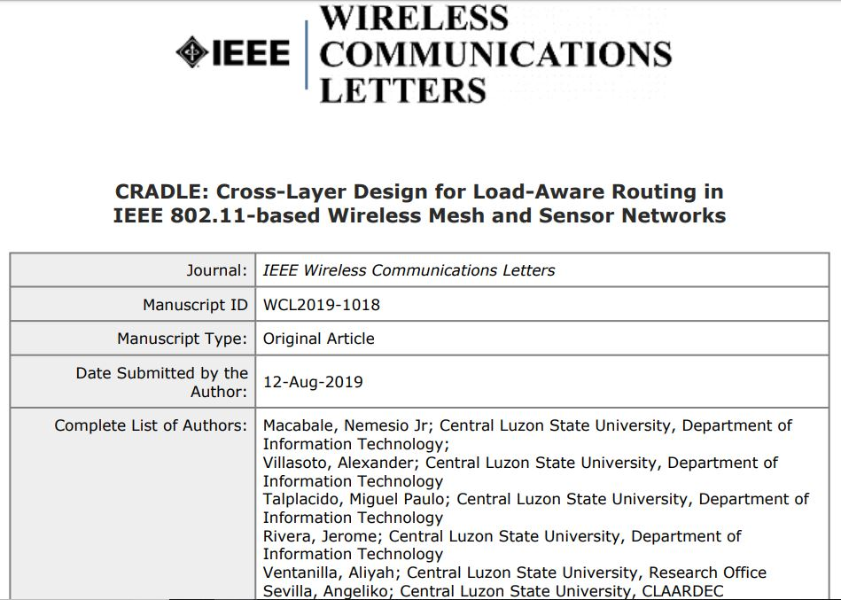
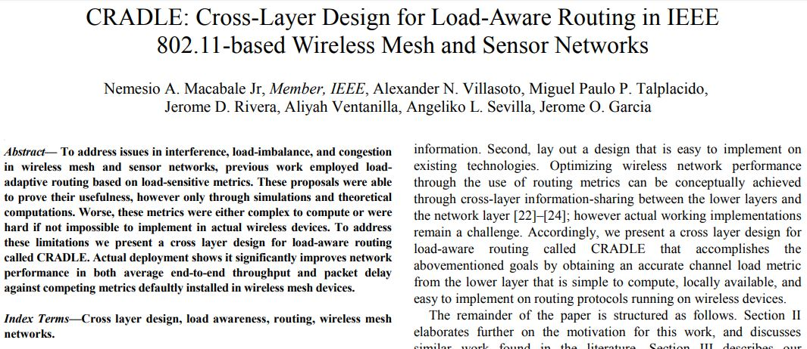

I am really happy to extend my sincerest motivation to all of you that are actively sharing your progress for this challenge. By reading your awesome learnings, you keep me motivated. Keep making your progress guys!

&#35;60DaysofUdacity

Day 47:
------
1. Watched a really illuminating talk between Sebastian Thrun's interview of Fe-Fei Li about putting humans in the center of AI.
2. Spent hours sampling the large chest X-ray dataset for #sg_novice-ai. Sleep has no match for me :D. You can look at my Colab Notebook here:
https://github.com/ArseniusNott/60DaysofUdacity/blob/master/Chest_X_Ray_Preparation_with_Sampling.ipynb

Thoughts:
Coming from Li herself, AI is a technology that is about humans. AI therefore is not a feat of its own but rather a collective milestone of humans that should cater human values. This is technology that is about humans. That there is no independent value of AI. AI values should be human values. Lastly, an all-encompassing point of the talk, many technologies have bigger potential to enhance and augment humans, rather than replace them.

I am really happy to extend my sincerest motivation to all of you that are actively sharing your progress for this challenge. By reading your awesome learnings, you keep me motivated. Keep making your progress guys!

&#35;60DaysofUdacity

Day 48:
------
Milestones
1. I started on using Google Cloud Platform' Cloud Vision API as benchmark for Optical Character Recognition that will be used by our organization in our myriad of services. I am really excited to utilize set of services that in the future will help me create my own computer vision model.
2. I finally finished the Securing Federated Learning lesson from the challenge.
3. Participated in a lengthy discussion for our showcase project and clarified some interesting insights from the dataset that we have. Upon checking with the data, I adjusted the preparation requirements accordingly and recreated the dataset for our purpose. Here is the link of my preparation notebook:
https://github.com/ArseniusNott/60DaysofUdacity/blob/master/Chest_X_Ray_Data_Preparation_with_9_Classess_accounting_for_Effusion's_View_Position.ipynb

Reflection:
With most of my free time devoted into comprehensive discussion with my peers, I realize that this really proves that a team with diverse set of skills and specialities will definitely have great progress creating amazing things. And I am proud to say that we are doing just that. Kudos to my team at #sg_novice-ai for our good works.

I am really happy to extend my sincerest motivation to all of you that are actively sharing your progress for this challenge. By reading your awesome learnings, you keep me motivated. Keep making your progress guys!

&#35;60DaysofUdacity

Day 49:
------
Milestones:
1. I recently created a MEAN stack application that consumes a Google Cloud Vision API to extract texts from images using DOCUMENT_TEXT_DETECTION optimized for dense text and documents.
I was pretty challenged by working with authentication using Node since documentation is largely inconsistent between the official documents and sample code. Maybe Google can democratize their documentation so that enthusiasts can rectify errors and inconsistencies. This really wasted a significant amount of time.
2. Since the model team in sg_novice-ai acquired not so good validation accuracy due to limited data, I regenerated a dataset using my script. Have a look at the dataset structure in the images below. Also, here it my notebook:
https://github.com/ArseniusNott/60DaysofUdacity/blob/master/Chest%20X-Ray%20Dataset%20Preprocessing/04_Chest_X_Ray_Data_Preparation_with_8_Classess_Increased_Images.ipynb
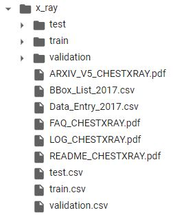
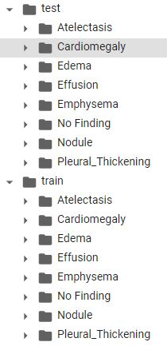
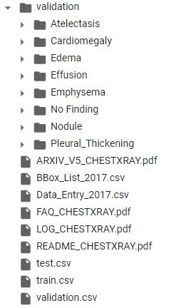

Guys, I recently got an email from Amazon giving me $25 AWS credits for being part of the recent AWS Innovate Online Conference. This is pretty nice.

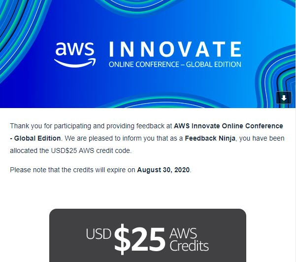

I am really happy to extend my sincerest motivation to all of you that are actively sharing your progress for this challenge. By reading your awesome learnings, you keep me motivated. Keep making your progress guys!

&#35;60DaysofUdacity

Day 50:
------
1. I joined the meeting arranged by my good friends at #sg_goodfellows. Since the members are not synced yet with the reading progress of the Deep Learning book, we devised a plan to engage members with learning by dividing the members per group chapter where each is responsible for creating quizzes to test our understanding per chapter.

2. I recently joined another virtual meeting from my good friends at #sg_novice-ai. We are now on the modeling stage using the data subset that I generated. We discussed plans on how can we implement a real-world application of federated learning with our current use case. Several suggestions are really interesting and I hope that this could continue even after the challenge.
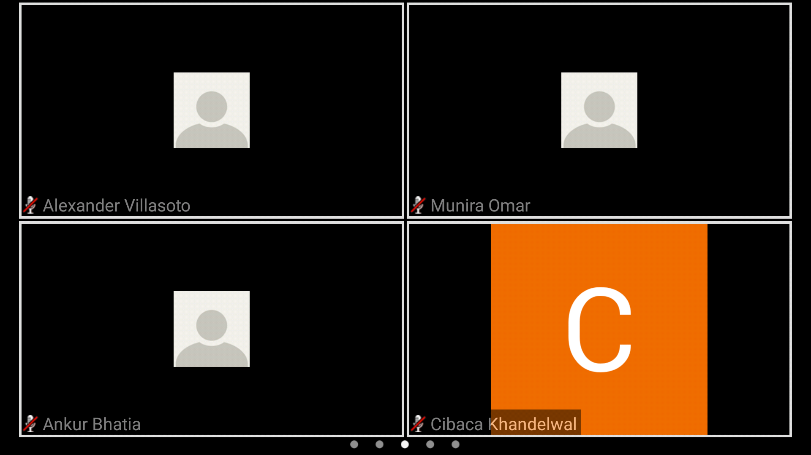
3. I am really happy to announce that the Optical Character Recognition application that I am doing for the past few days for our organization has been implemented and is currently being used now. I am getting good feedback so far as the system really helps in minimizing the time of my peers to count words in documents. This will really be a good direction for me to look at and I am really excited.

I am really happy to extend my sincerest motivation to all of you that are actively sharing your progress for this challenge. By reading your awesome learnings, you keep me motivated. Keep making your progress guys! This marks my day 50 of 60 Days Challenge. Keep going guys!

&#35;60DaysofUdacity

Day 51:
------
One Major Milestone:
Today, I finished the whole course challenge, finishing the Encrypted Deep Learning course. It took me very long to finish the whole course due since I want to finish challenge projects on my own. Although I did not finish the keystone project due to showcase project deadline. Still, my NLP project is underway that I thought federated learning would be a good use case for that.
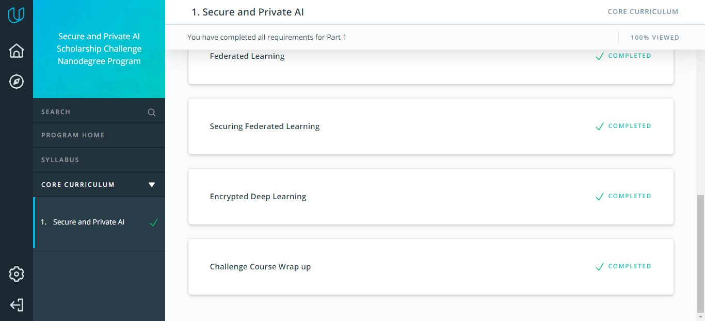

Summary:
Now I realized that Secure and Private AI is not only about differential privacy. It is a collection of techniques that have strengths and weaknesses depending on the goals of privacy, trusts configuration, ease of implementation and the actors who will participate in achieving privacy-preserving data pipelines. Following the summary of Andrew Trask, I listed down these techniques and how they blend in to the aforementioned trade-offs:
1. PATE - useful when we want to label our datasets by utilizing private datasets or datasets that are sensitive in nature, effectively aggregating each output by some aggregation techniques (majority vote as the most common).
2. Epsilon-Delta Tool - useful when we want to constrain the access to our sensitive data or the other way around by assigning parameters epsilon and delta, adhering to the formal definition of privacy. These parameters determine how much data owners must trust data modelers/researchers to protect their privacy in the process of learning. 
3. Vanilla Federated Learning - useful when we don't want to aggregate collective training data for legal, social and logistic reasons so one must setup multiple actors that will share modeling process, then aggregate model information to a trusted aggregator. This requires a little bit of trust especially to the aggregator to not leak model information across actors.
4. Secure additive aggregation - useful when you solve privacy issues in federated learning by doing field additive aggregation techniques to encrypts model information so trusted aggregators cannot glean on raw gradients sent by federated nodes. 

I am really happy to extend my sincerest motivation to all of you that are actively sharing your progress for this challenge. By reading your awesome learnings, you keep me motivated. Keep making your progress guys!

&#35;60DaysofUdacity

Day 52:
------
Milestones:
1. I created a simple interface to the final project for #sg_planetearth and the response to my peers is pretty positive.
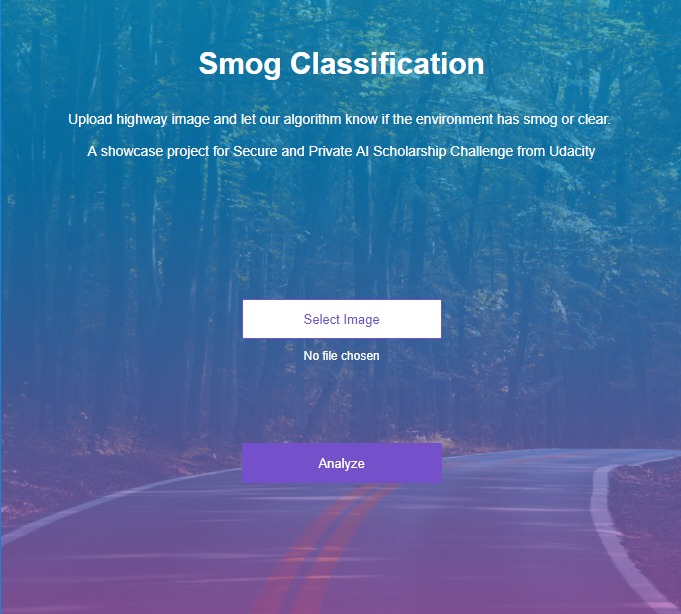
2. Updated the documentation for #sg_novice-ai showcase project. I was assigned to delineate future works for federated learning using remote devices. Since I had experience working with Raspberry Pi, I proposed it to be used in federated aspect of model improvement.
3. Participated in a meetup for #sg_novice-ai where we clarified things such as documentation and model deployment. I think we are almost ready to submit our project now. I am glad to be part of an amazing team.
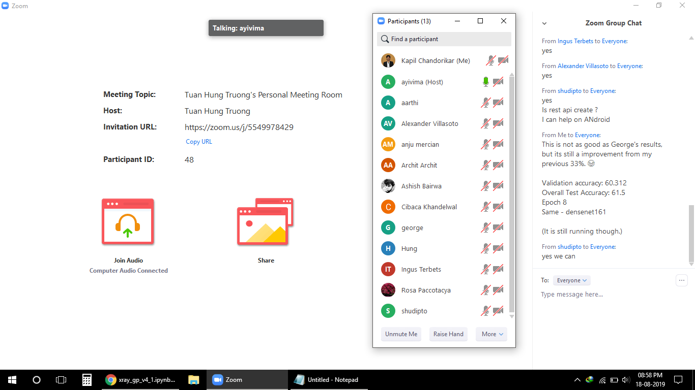

I am really happy to extend my sincerest motivation to all of you that are actively sharing your progress for this challenge. By reading your awesome learnings, you keep me motivated. Keep making your progress guys!

&#35;60DaysofUdacity